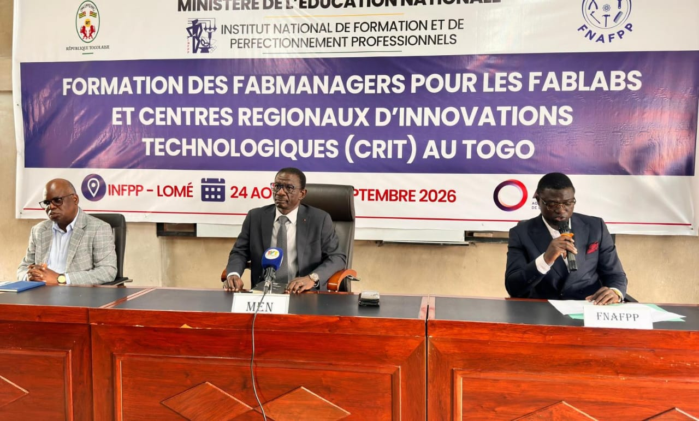

# JOURNAL DU 24 AOUT 2026
## Resumé du jour

- [ ] **CEREMONIE DE LANCEMENT OFFICIEL DE LA FORMATION DES FABMANEGERS**

> Tout a commencé avec l'arrivé des nouveaux Fabmanagers à 7h,
> Ensuite l'installation du personnel administratif, des formateurs et des medias,

- Mots de bienvenue du Directeur de l'INFPP
- Discours du responsable du FNAFPP
- Discours du Ministre de l'Education Nationnal
- Le MEN a ensuite procédé à la visite des locaux et des equipements qui permettront de mieux outiller les nouveaux fabmanagers

> Une photo de famille a été prise avec le MEN après tout cela,

> Après une pause déjeuné de 1h, nous avions continué la suite des activités comme suit:

- [ ] Distribution des ordinateurs portables a ceux qui n'ont pas

- [ ] Partages des fichiers par clé USB

- [ ] Installations des logiciels avec l'aide des formateurs

> Après cela nous avions commencé le cours qui a pour intitulé:

## Documenter avec Git, GitHub et GitHub Pages

> les grandes lignes qui ont été dévéloppé sont :

1. Nous avions définis c'est quoi Documenter
2. Nous avions parler de [GitHub](https://github.com) 
3. Les outils : VSCode, Git, , GitPages 
4. Présentation du langage Markdown
5. Creation des comptes **Github**
6. Initialisation des dépôts
7. Travaux pratiques : la journalisation 