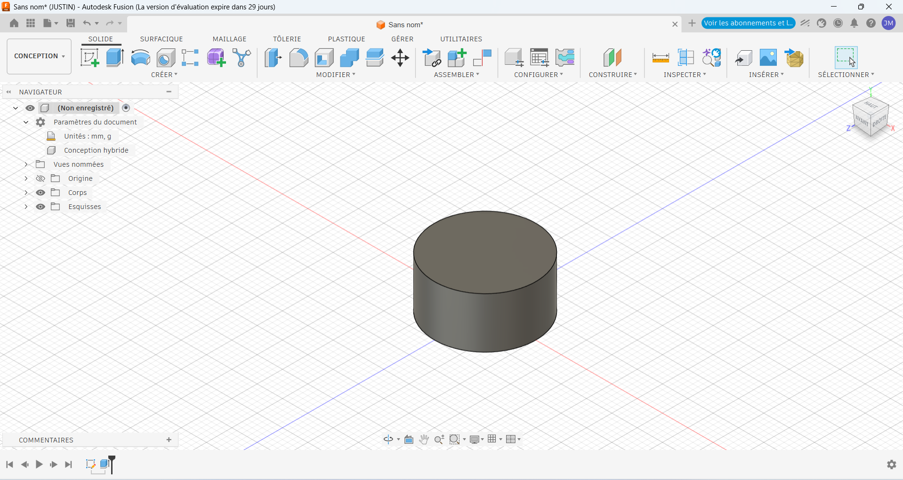

# Journal — Mardi 01 septembre 2026 (rédigé par : Essozolam Justin MAZA)

## Présentation du programme et répartition des groupes

La journée a débuté par la présentation du programme des différentes activités prévues. 

Afin de permettre à tous les participants de bénéficier des différents ateliers de formation, nous avons été répartis en trois groupes : 
- Le premier groupe a poursuivi la formation sur le logiciel Fusion, 
- le deuxième groupe a participé à l'atelier consacré à l'impression DTF, tandis que 
- le troisième groupe a suivi une initiation à l'électronique. Au cours de la journée, 

Les différents groupes ont participé successivement à ces trois ateliers.

## Atelier de conception sur Fusion

Dans le cadre de la poursuite de la formation sur Fusion, nous avons réalisé des exercices pratiques de modélisation 3D. 

L'activité principale a porté sur la création d'un cylindre. Nous avons appris à réaliser un cylindre suivant trois méthodes différentes :
- la première méthode à l'aide de l'outil Révolution ;
- la deuxième méthode à l'aide de l'outil Extrusion ;
- la troisième méthode à l'aide de l'outil automatique de création de cylindre.

Ces différents exercices nous ont permis de mieux comprendre les possibilités offertes par le logiciel et d'observer les différentes méthodes pouvant être utilisées pour obtenir une même forme. 

La pratique de ces outils a également contribué à renforcer notre maîtrise de la modélisation 3D.

- Cylindre realisé sous fusion 360

## L'IMPRESSION DTF AVEC xTool

Nous avons ensuite participé à une formation consacrée à l'impression DTF 

Cette séance a débuté par un cours théorique au cours duquel les différentes étapes et le principe général de cette technique d'impression nous ont été présentés.

- Concevoir
- Imprimer
- Poudrer
- Cuire
- Presser
- Retirer

Après cette présentation, plusieurs exemples pratiques ont été réalisés afin de mieux comprendre le processus de préparation et d'impression. 

Chaque participant a ensuite eu l'occasion de réaliser son propre exemple.

Les différents travaux réalisés seront ensuite imprimés, ce qui permettra à chacun de constater concrètement le résultat de son travail et de mieux comprendre les différentes étapes du processus d'impression DTF.

- Exemple de DTF realisé

## Initiation à l'électronique

Pour terminer la journée, nous avons participé à un atelier d'initiation à l'électronique. 

Au cours de cette séance, le formateur nous a présenté le protoboard, également appelé plaque d'essai.

Nous avons découvert son fonctionnement ainsi que son utilité dans la réalisation et le test des circuits électroniques. 

Après la présentation théorique, nous avons réalisé différentes connexions sur le protoboard afin de mieux comprendre la manière dont les composants électroniques peuvent être interconnectés.

Cette activité pratique nous a permis de nous familiariser avec les bases du câblage sur une plaque d'essai et d'observer concrètement le fonctionnement des connexions électroniques.

## Bilan de la journée

Cette journée a été particulièrement enrichissante, car elle nous a permis d'acquérir des connaissances dans trois domaines complémentaires : 
- la conception et la modélisation 3D avec Fusion, l'impression DTF et l'électronique.

Les différentes activités pratiques réalisées au cours de la journée ont permis de mettre en application les notions présentées par les formateurs et de développer progressivement nos compétences techniques. 

La diversité des ateliers nous a également permis de découvrir plusieurs outils et techniques susceptibles d'être utilisés dans la réalisation de nos différents projets.

