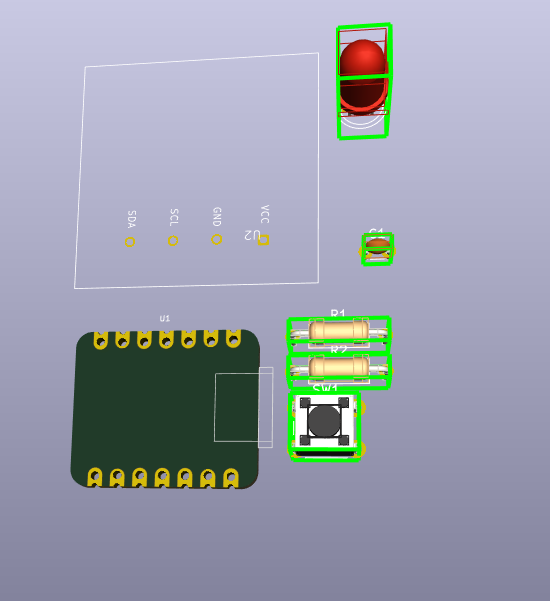

# Journal — Mercredi 09 septembre 2026 (rédigé par : Justin Essozolam MAZA)

## Fait aujourd'hui

### Matinée — Du schéma électronique au PCB

Schéma électronique
Schéma électronique du projet

Réalisation de la vue 3D correspondante. Vue 3D du projet
Vue 3D du montage

Constat : tous les composants ne sont pas disponibles nativement dans KiCad, et même les librairies existantes ne couvrent pas tout.

1. Ajout d'une librairie pour le Xiao ESP32-S3 , et création d'une librairie personnalisée pour l'écran Oled .
Découverte qu'une librairie peut être ajoutée soit pour un seul projet, soit globalement — nous avons choisi l'option globale.
2. Poursuite avec les assignations des composants, puis passage au circuit PCB .

## Après-midi — Rappels théoriques et codes

Petit retour aux fondamentaux : 
1. qu'est-ce que l' informatique , 
2. un PC , 
3. la différence hardware/software ,  
4. les périphériques d'entrée et de sortie .

Écriture du code MicroPython pour piloter l'ensemble du système.

## Appris

Créer sa propre librairie (ex. pour l'écran) est parfois nécessaire lorsque le composant n'existe dans aucune bibliothèque officielle.

Rappel structurant : un ordinateur combine toujours du matériel (les composants physiques) et du logiciel (les programmes), reliés par des périphériques d'entrée (clavier, capteurs...) et de sortie (écran,...).

## Raté, puis corrigé

Composants et librairies manquants dans KiCad au moment du schéma → recherche et ajout de la librairie Xiao ESP32-S3 → création d'une librairie maison pour l'écran
## Décider

Installation des bibliothèques KiCad en mode global 

## À faire demain

1. Finaliser le routage du PCB 
2. Tester le code MicroPython sur le montage réel

