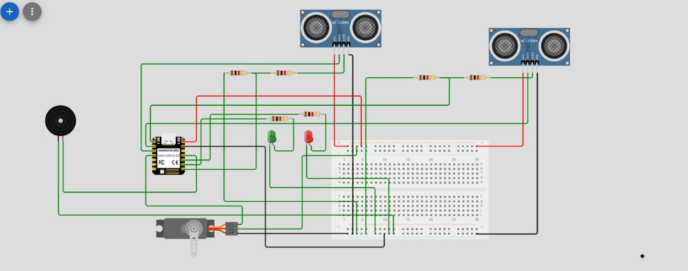

# Journal — Jeudi 10 septembre 2026 (Rédigé par : Justin Essozolam MAZA)

## Fait aujourd'hui

### Matinée — Conception et réalisation de la poubelle intelligente

Nous avons travaillé en groupe sur notre projet de **poubelle intelligente**. La matinée a principalement été consacrée à la conception physique de la poubelle et à la préparation des différents éléments nécessaires à sa réalisation. 

On a utilisé [Atomm AI](https://ai.atomm.com/3d/editor?template_id=186945&sid=ss20447368892e2e4b) pour faire entrée les parametre et dimmension

Nous avons commencé par **dimensionner la poubelle à l'aide du logiciel XTool**, en tenant compte des dimensions souhaitées et du matériel disponible. Une fois la conception réalisée, les différentes pièces ont été découpées à l'aide de la **machine de découpe laser**.

Cette étape nous a permis de passer de la conception numérique à la réalisation physique d'un premier modèle de la poubelle.

### Après-midi — Préparation du système électronique

Nous avons également travaillé sur la partie électronique du projet. Un premier **schéma électrique** de la poubelle intelligente a été réalisé. 

Ce circuit constitue une première base de travail que nous devrons améliorer par la suite à l'aide de **KiCad**, notamment pour concevoir le circuit imprimé (**PCB**).

Au cours de la journée, nous avons également récupéré les différents composants électroniques nécessaires à la réalisation du projet. Chaque groupe avait préalablement établi et fourni une **liste du matériel nécessaire** à son projet.

La prochaine étape consistera à tester individuellement les différents composants afin de vérifier leur fonctionnement avant de procéder à l'assemblage complet du système.

## Appris

Cette journée nous a permis de mieux comprendre les contraintes liées à la conception d'un objet réel. La réalisation d'un modèle réaliste ne consiste pas uniquement à définir une forme ou des dimensions : il faut également tenir compte du **type de matériaux et des composants réellement disponibles**.

Nous avons également compris que le choix de la forme de la poubelle doit être réfléchi en fonction de son utilisation, de son mécanisme d'ouverture et de la manière dont les différents composants électroniques pourront être intégrés.

Une attention particulière a été portée au **mécanisme d'ouverture du couvercle**. Nous avons réfléchi à la manière de réaliser ce mécanisme en limitant au maximum les frottements afin de faciliter le mouvement et de permettre au moteur de fonctionner dans de bonnes conditions.

## Raté, puis corrigé

Au départ, nous avions prévu d'utiliser un **servomoteur SG90** pour commander le mécanisme d'ouverture du couvercle. Cependant, après réflexion sur les contraintes mécaniques du système et les efforts nécessaires pour déplacer le couvercle, nous avons constaté que ce servomoteur ne serait probablement pas suffisamment adapté à notre mécanisme.

Nous avons donc décidé de remplacer le SG90 par un **servomoteur MG995**, qui sera mieux adapté aux contraintes du mécanisme envisagé.

Cette modification nous a également amenés à revoir certains aspects de la conception afin de tenir compte du nouveau servomoteur et de ses dimensions.

## Décider

Nous avons décidé de poursuivre la conception de la poubelle en tenant compte des composants réellement disponibles.

Pour la partie électronique, nous avons retenu le principe d'améliorer le premier circuit électrique en réalisant par la suite le schéma sous **KiCad**, puis en concevant le **PCB** correspondant.

Concernant le mécanisme d'ouverture, nous avons décidé d'abandonner le **SG90** au profit du **MG995** afin de disposer d'un servomoteur mieux adapté aux contraintes mécaniques du couvercle.

## À faire demain

1. Poursuivre l'amélioration de la conception de la poubelle.
2. Tester individuellement les différents composants électroniques récupérés.
3. Vérifier le fonctionnement du servomoteur MG995.
4. Améliorer le schéma électronique du projet.
5. Commencer la conception du circuit sous KiCad en vue de réaliser le PCB.
6. Réfléchir à l'assemblage des différentes parties de la poubelle et à l'intégration du système électronique.